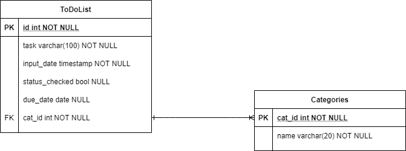

# Name of DB file
***to_do_list***

# Trello Link

https://trello.com/b/93WzXLsd/alec-to-do-app-php-sql-full-stack

# ERD Diagram

# SQL file
Included

# Citation summary

# CSS borrowed from

https://github.com/codingWithElias/php-to-do-list/blob/master/css/style.css

# if statment to check if checkbox is 1 or 0 (by Tammy Valgardson)

      `if ($row['checked'] == 1)
         {
             $tasks .= '<input value="'.$row['checked'].'" type="checkbox" checked>';
         }
         else
         {
            $tasks .= '<input value="'.$row['checked'].'" type="checkbox">';
         }` 

<!-- instead of having this inside the sprintf 
//   `<input value="%d" type="checkbox">
                // $row['checked'],    `          -->

# script to prevent popup asking for resubmission

https://wordpress.stackexchange.com/questions/96564/how-to-stop-form-resubmission-on-page-refresh/96565

# original idea to let user edit everything with the following FORM

`<form action="#" method="POST" enctype="multipart/form-data">
    <?php echo $show_edit_id; ?>
    

        <label for="todoTitle">Todo Task</label>
        <input type="text" name="todoTitle" id="todoTitle" value="<?php echo $edit_todoTitle; ?>">
    

    

        <h3>Status Checked</h3>
        <input type="hidden" name="<?php echo $show_edit_id; ?>" id="check-status" value="<?php echo $edit_checked; ?>">
        <input value="<?php echo $edit_checked; ?>" type="checkbox" >
    

    

        <h3>Date</h3>
     <?php echo $show_edit_date; ?>
    

    

        <label for="duedate">Edit Due Date</label>
        <input type="date" name="duedate" id="duedate" value="<?php echo $edit_duedate; ?>" min="2020-09-01" max="2021-09-01">
    

    

        <label for="catID">Edit Category</label>
        <input type="number" name="catID" id="catID" value="<?php echo $edit_catID;?>" min="1" max="2">
        <small>Note: to edit category type 1 for Chores or 2 for Homework</small>
    

    

        <input type="submit" value="Submit edits">
    

    </form>`
    
   # Delayed redirection (by Marcel G)

    https://www.php.net/manual/en/function.header.php

